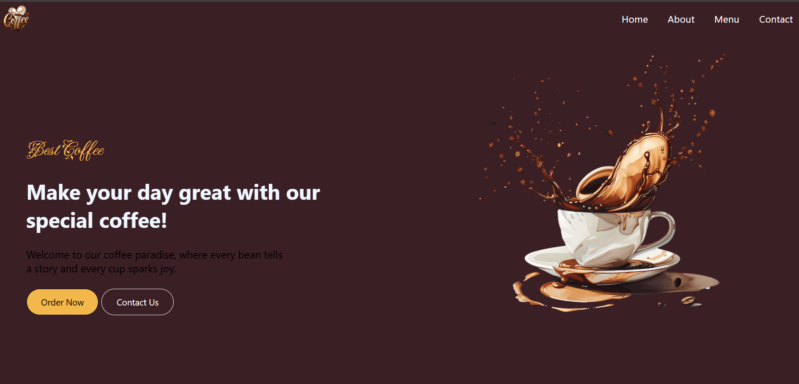

# Coffee Shop Website

A clean and modern, single-page landing website for a coffee shop, designed with HTML and CSS. This project showcases the shop's menu, shares its story, and provides a way for customers to get in touch.

---

# Screenshot

---

## ✨ Features

-   **Hero Section:** A welcoming header with a catchy tagline and call-to-action buttons.
-   **Smooth Navigation:** A sticky navigation bar that links to different sections of the page.
-   **About Us:** A dedicated section to tell the story and mission of the coffee shop.
-   **Menu Showcase:** A clean, grid-based layout to display menu categories like Hot Beverages, Cold Beverages, and Desserts.
-   **Contact Form:** A simple and effective form for customer inquiries.
-   **Custom Styling:** A warm, modern design with custom fonts from Google Fonts and a cohesive color scheme.

---

## 🛠️ Technologies Used

This project was built using fundamental web technologies:

-   **HTML5:** For the structure and content of the website.
-   **CSS3:** For styling, layout (including Flexbox), and design.
-   **Google Fonts:** For custom typography to enhance the visual appeal.

---

## 🚀 How to Run

Since this is a static website, no special installation is required.

1.  Clone or download the repository to your local machine.
2.  Navigate to the project directory.
3.  Open the `index.html` file in your web browser.

And that's it! You can now view the website.

---

## 📂 File Structure

-   `index.html`: The main HTML file containing the structure of the website.
-   `style.css`: The stylesheet containing all the custom styles.

---

## 📜 License

This project is for personal and educational purposes only. It is not licensed for commercial use.

If you use or modify this code, please provide a small credit by linking back to this repository or mentioning the original author (Shibudas-dev). Thank you!
